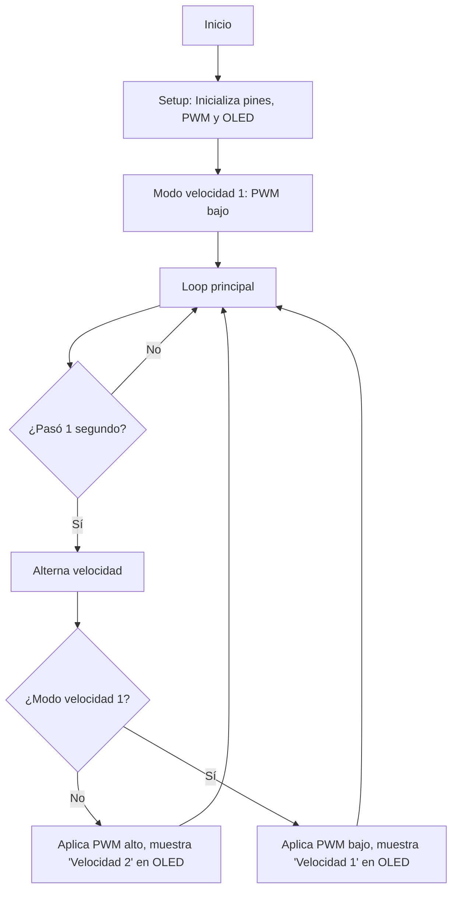

```mermaid
    flowchart TD
        A[Inicio] --> B[Setup: Inicializa pines, PWM y OLED]
        B --> C[Modo velocidad 1: PWM bajo]
        C --> D[Loop principal]
        D --> E{¿Pasó 1 segundo?}
        E -- No --> D
        E -- Sí --> F[Alterna velocidad]
        F --> G{¿Modo velocidad 1?}
        G -- No --> I[Aplica PWM alto, muestra 'Velocidad 2' en OLED]
        G -- Sí --> H[Aplica PWM bajo, muestra 'Velocidad 1' en OLED]
        
        H --> D
        I --> D

```